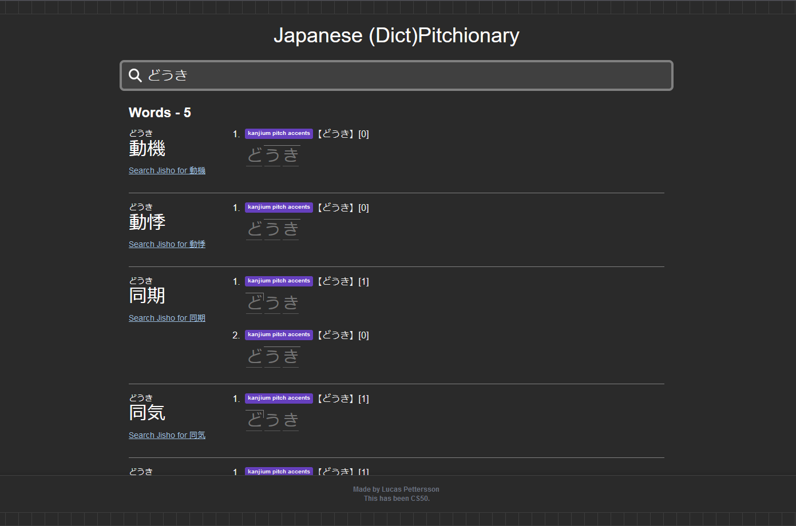
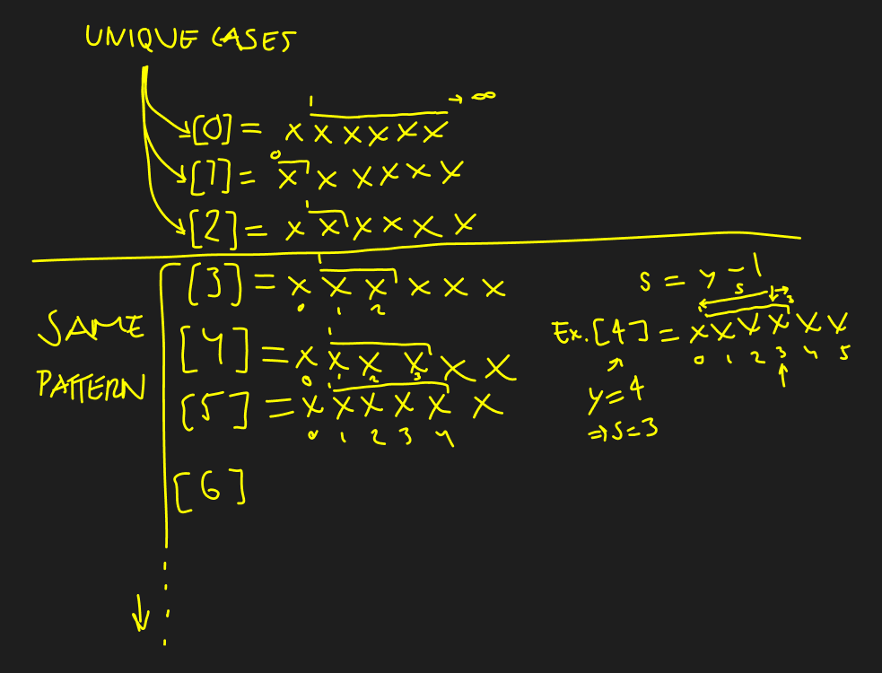
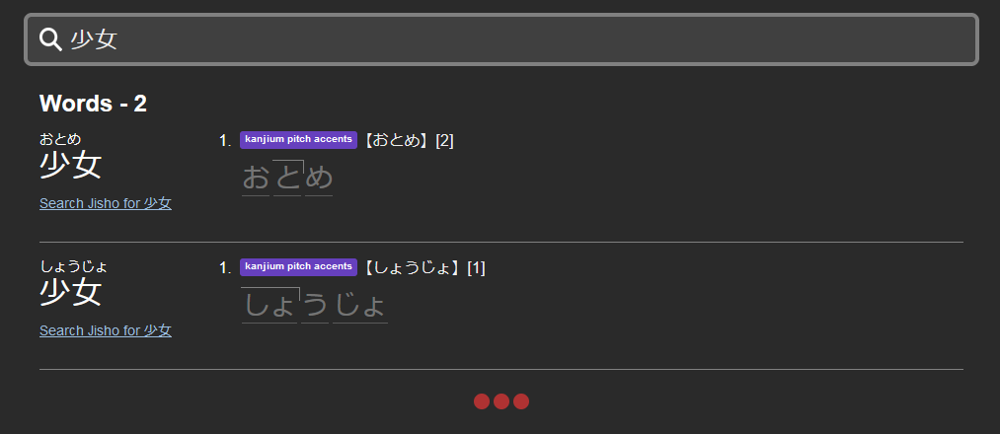

# Japanese Pitch Accent Dictionary
#### Video Demo:  <URL HERE>

## Introduction


Upon deciding on this project, I merged two interests: Japanese and programming. Specifically, I decided to create a dictionary that visualizes the pitch for a certain word in the form of a website. The pitch is what the user wants to know, not the meaning of the word, so it is not included, but it can be accessed by a provided link to [jisho.org](https://jisho.org/), a powerful Japanese-English dictionary.

It's important to note that in Japanese *homonyms* are very common, for example, if you input `き` you will get multiple words of the same reading but with different kanji and varying pitches. Therefore, to get a more accurate result you might input `木`(tree), `気`(spirit), or `期`(time period) instead to get the specific word you're looking for.

### Finding the resources

#### Pitch Data
The most convenient resource I found was the GitHub repository [kanjium](https://github.com/mifunetoshiro/kanjium/tree/master). I downloaded 
`kanjium/data/source_files/raw/accents.txt` which holds data entries/rows of $n>10^{6}$ where $n$ is the number of entries/rows.

`accents.txt` is a tabular text data file which follows the following structure: 
`kanji | hiragana | pitch`
- **kanji**: The word's reading with kanji,
- **hiragana**: The syllable reading of the word,
- **pitch**: Itemized with commas, for example, `4,2,1`. May have multiple pitches. May contain tags such as 名 (noun), 形動 (na-adjective), 感 (interjection) and 副 (adverb).

## Implementation

### Library & Framework
I decided to use **React** to create components with **Next.js** to handle the client and server-side components which includes creating getting the pitch data, and then displaying it on the page.

### Structure
Write about layout.tsx and page.tsx.
The site uses only one page, even so a root ``layout.tsx`` file is used for the template structure. Beyond, is a ``page.tsx`` used for placing the rest of the **React** components or base html that will always exist on the site, such as the header and footer content.

The code is divided into multiple components each having a specific job. ``PitchItem``, ``SearchList`` and ``SearchPitches``.

#### SearchPitches
``SearchPitches`` is a client component, meaning if you want to manipulate data or store states you would need a client component which in this case simply handles the input field. Using ``searchParams`` I pass a query as you type which you can see at the and of the web address ``?query=INPUT``. This way other components can access the user input.

#### SearchList
``SearchList`` - a server component - according to the user input will search through the pitch accent data looking for the correspondig row. I use ``split("\n")`` to get each row, and then ``split("\t")`` to get each data in the row's columns `kanji | hiragana | pitch`.

*(I did debate if I should use SQL as a database, but because the user cannot update the data I saw no need to do so and the data itself is not of a sensitive nature.)*

Check if the input is either the kanji reading or hiragana/furigana reading. Then pass the result to ``PitchItem`` which will then dynamically display it on screen.

##### Search Algorithm
It's rather simple, by using the ``fs`` module's ``readFile`` method I get read the data and as below:

```typescript
const accents = await fs.readFile(process.cwd() + '/app/data/accents.txt', 'utf8');
const formatLines = accents.split("\n");

const filteredPitches = formatLines.filter(item => {
    const stringArr = item.split("\t");

    if ((query == stringArr[0] || query == stringArr[1])) {
        return stringArr;
    }
});
```

``filteredPitches`` is an array of strings, each array is a different word that fit our input. The ``PitchItem`` component then parses that data and displays it on screen. 

It takes about 60 - 100ms to find the word(s), but because this is triggered each time you enter a character, I think, in hindsight, executing the search on an independant button instead would be wiser to decrease ``GET`` requests.

#### PitchItem
This server component parses the data received from the input and displays it on the page. First, the word needs to be split into individual characters, I ended up using a regex for this.

```typescript
// Define a regular expression to match special Hiragana combinations and individual characters
const regex = /しょ|じょ|りょ|にょ|ちょ|ちゃ|./g;
// Split the word into individual letters according to regex
const furiganaArray = textToUse?.match(regex);

```

As you can see in the regex, certain Japanese characters is needed to be treated as one character (syllable) instead of two seperate ones, for example, ``し`` and ``ょ`` are seperate characters in a string, but in Japanese would be used together to form one syllable ``しょ``, and so on.

We also get the tags associated with each individal pitch: adverb, na-adjective, interjection, noun. These are quite rare in the data but needed to be accounted for using the ``parseInput`` function. The pitch data could take this ``string`` form: ``"(副)0,(名)4"``.

```typescript
const parseInput = (input: string) => {
    // eslint-disable-next-line @typescript-eslint/no-unused-vars
    const types = ["名", "形動", "感", "副"];
    type TypeKey = typeof types[number]; // "名" | "形動" | "感" | "副"

    const result: Record<TypeKey, string[]> = {
        名: [],
        形動: [],
        感: [],
        副: []
    };

    const regex = /\((名|形動|感|副)\)([0-9,]*)/g;

    let match: RegExpExecArray | null;
    while ((match = regex.exec(input)) !== null) {
        const type = match[1] as TypeKey; // Explicitly cast match[1] to TypeKey
        const values = match[2].split(",").filter(v => v.trim() !== "");
        result[type].push(...values);
    }

    const hasTypes = Object.values(result).some(values => values.length > 0);
    if (!hasTypes) {
        const numericRegex = /^[0-9,]+$/;
        if (numericRegex.test(input)) {
            return input.split(",").map(v => v.trim()).filter(v => v !== "");
        }
    }

    return result;
};
```

Then we pass all this data to the ``CreatePitch`` function as below to finally display it on the page:

```typescript
function CreatePitchItem(furiganaArray: string[], furigana: string, pitch: object | string[])
{
    // Create tags (adverb, adjective, interjection)
        let itemCount = 0;
    const pitchArray: string[] = [];
    const pitchTypeArray: string[] = [];

    // If array input ==> without type tags
    if (Array.isArray(pitch)) {
        pitch?.map((object) => {
            pitchTypeArray.push("");
            pitchArray.push(object);
        })
    }
    // If object input ==> with type tags
    else if (typeof pitch === "object" && pitch !== null) {
        for (const [type, values] of Object.entries(pitch)) {
            if (values.length > 0)
            {
                values?.map((item: string) => {
                    pitchTypeArray.push(type);
                    pitchArray.push(item);
                })

            }
        }
    }

    return pitchArray?.map((pitchItem: string, i) => {
        
        itemCount++;

        const pitchVisualHTML = CreatePitchVisualAlgorithm(furiganaArray, pitchItem);

        // Get the type tag in english
        const pitchTypeTagEng = pitchTypeArray[i] == "感" ? "int" 
            : pitchTypeArray[i] == "副" ? "adv"
            : pitchTypeArray[i] == "名" ? "noun" 
            : pitchTypeArray[i] == "形動" ? "adj-na": "";

        // Get the type tag html
        const pitchTypeTag = pitchTypeArray[i] == "" ? "" : <span className='tag word-pitch-data-type'>{}{pitchTypeArray[i]}.{pitchTypeTagEng}</span>;

        return (
            <>
                <div key={pitchItem} className='word-pitch-container'>

                    <div className='word-pitch-data-container'>
                        <span className='pr-2'>{itemCount}.</span>
                        <span className="tags-container">
                            <span className='tag word-pitch-data-dictionary'>Kanjium Pitch Accents</span>
                            {pitchTypeTag}
                        </span>
                        <span className='word-characters-data'>
                            <span>​【{furigana}】</span>
                            <span>[{pitchItem}]</span>
                        </span>
                    </div>

                    <div className='pitch-vizualizer-container'>
                        <span className='pitch-vizualizer-characters-container'>
                            {pitchVisualHTML}
                        </span>
                    </div>

                </div>
            </>
        )
    });
}
```

##### Pitch Visualization Algorithm
<!--  -->
The image below is my first notes on how the pitch works.


Below, the algorithm ``CreatePitchVisualAlgorithm`` is the code translated from the notes above:

`furiganaArray` is simply an array of all the word's characters.

``pitch`` is the type of pitch we are working on. There are four cases (if-statements) where ``pitch = ``
- "0"
- "1"
- "2"
- "3" and above.

```typescript
function CreatePitchVisualAlgorithm(furiganaArray: string[], pitch: string) {
    let outputHTML;

    // Pitch type 0
    if (pitch == "0") {

        outputHTML = furiganaArray?.map((letter, i) => {
            if (i > 0) {
                return <span key={i} className="pitch-line-top">{letter}</span>;
            }
            else {
                return <span key={i}>{letter}</span>;
            }
        });
    }

    // Pitch type 1
    else if (pitch == "1") {

        outputHTML = furiganaArray?.map((letter, i) => {
            if (i == 0) {
                return <span key={i} className="pitch-line-top pitch-line-tail">{letter}</span>;
            }
            else {
                    return <span key={i}>{letter}</span>;
            }
        });
    }

    // Pitch type 2
    else if (pitch == "2") {

        outputHTML = furiganaArray?.map((letter, i) => {
            if (i == 1) {
                return <span key={i} className="pitch-line-top pitch-line-tail">{letter}</span>;
            }
            else {
                return <span key={i}>{letter}</span>;
            }
        });
    }

    // Pitch type 3...infinity
    else if (Number(pitch) >= 3) {

        outputHTML = furiganaArray?.map((letter, i) => {

            const final = Number(pitch) - 1;

            if (i == final) {
                return <span key={i} className="pitch-line-top pitch-line-tail">{letter}</span>;
            }
            else if (i > 0 && i < final) {
                return <span key={i} className="pitch-line-top">{letter}</span>;
            }
            else {
                return <span key={i}>{letter}</span>;
            }
        });
    }

    return outputHTML;
}
```

Each case creates a different visual and then returns the HTML. If the pitch has a value equal to or above 3 then the pitch will always follow the same pattern.

For example with input ``少女``(girl) we get this result:



As you can see, we've received two readings as a result for ``少女``:
- ``おとめ``, pitch = 2
- ``しょうじょ`` pitch = 1

This is a case where a word can be read differently but written the same in kanji. Each word (``PitchItem``) has its pitches enumerated since a word can have multiple pitches.

``おとめ`` starts high in the middle and then low (中高) whereas ``しょうじょ`` starts high in the beginning and then low (頭高). In hindsight, I should have included these terms in the search results.